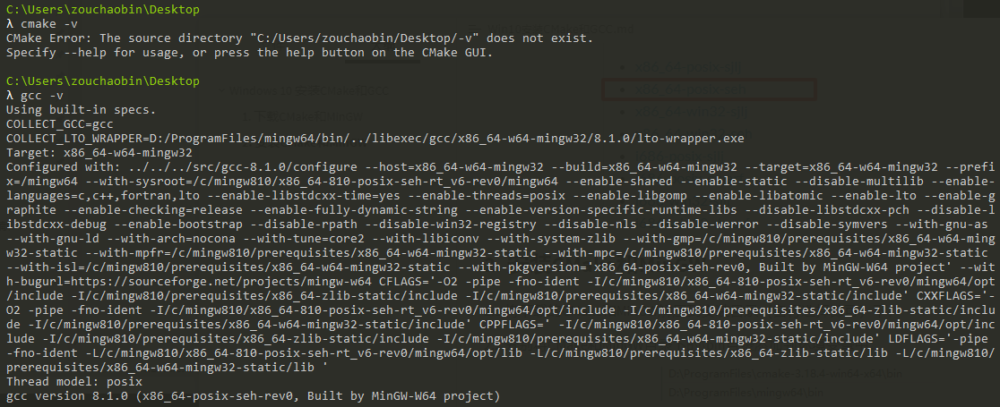

# Windows 10 安装CMake和GCC

---

## 1. 下载CMake和MinGW

我们直接下载源码解压即可（zip版本），不用下载安装版本(setup.exe版本)。

CMake下载地址：https://cmake.org/download/


MinGW下载地址：https://sourceforge.net/projects/mingw-w64/files/mingw-w64/


## 2. 安装CMake和MinGW

2.1 将下载的CMake和MinGW解压到安装目录（自行选择即可）下；

2.2 分别将CMake和MinGW目录下的\bin目录添加到环境变量中：


2.3 使用cmd验证一下是否安装成功，输入以下命令，如果能够得到类似信息即说明安装成功：



2.4 将以文件mingw32-make.exe复制一份，然后重命名为make.exe：


2.5 验证一下make是否安装成功：


确保以下3个文件均在：


## 3. 验证CMake是否可用

3.1 新建文件夹，新建相应的.cpp, .c 和 .h文件，按照常规的CMakeList编写方法编写CMakeList，注意，要手动制定编译器。典型的CMakeList内容如下：


3.2 新建build文件夹，依次执行以下命令:

```
cd build
cmake -G "MinGW Makefiles" ..
make
```

然后执行生成的可执行程序，验证完成。


## 4. VScode下的使用

VScode需要安装以下插件：

> CMake
>
> Cmaketools